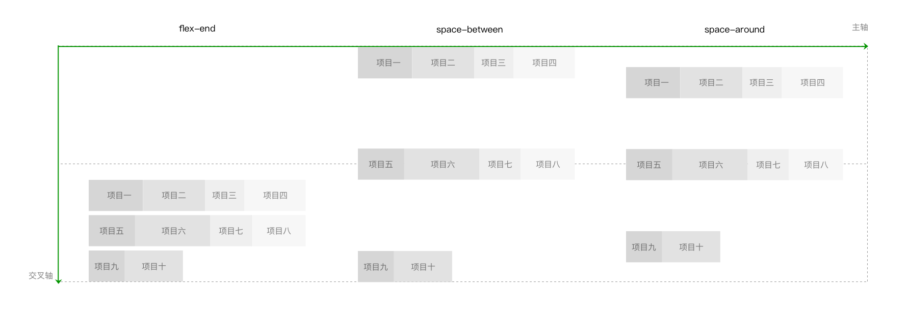
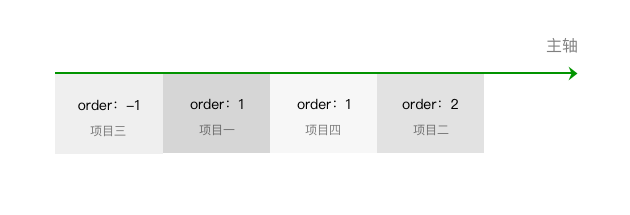
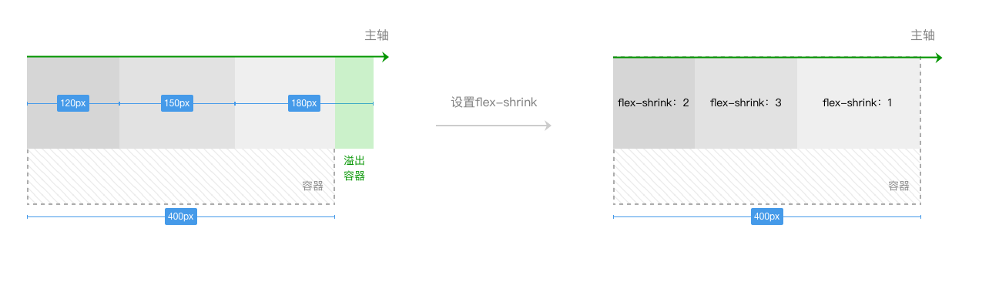
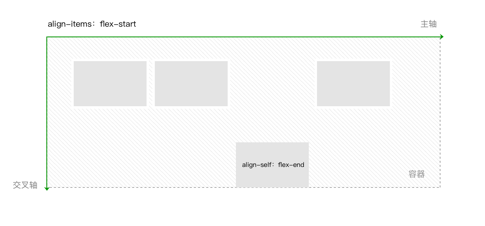

# 🍇flex布局🍇

本文参考微信小程序的基本布局方法 - flex布局  
[参考文章](https://developers.weixin.qq.com/ebook?action=get_post_info&docid=00080e799303986b0086e605f5680a) 

## 🐱‍👤开始 
设置容器的属性有：  
```css
.css{
    display:flex;

    flex-direction:row（默认值） | row-reverse | column |column-reverse

    flex-wrap:nowrap（默认值） | wrap | wrap-reverse

    justify-content:flex-start（默认值） | flex-end | center |space-between | space-around | space-evenly

    align-items:stretch（默认值） | center  | flex-end | baseline | flex-start

    align-content:stretch（默认值） | flex-start | center |flex-end | space-between | space-around | space-evenly
}
```
>（试都能试出效果）  

**总而言之，先把display选成flex吧！**

## 🟢 flex-direction
flex-direction 就是用来选主轴的  
- row 是横 
- column 是竖
- 后面带-reverse就是相反方向
>有图片，但是懒得放，这个很好理解。（算了还是放）


## 🟢 flex-wrap
允许换行
- nowrap 不允许（默认）
- wrap 允许换行
- wrap-reverse （反方向


## 🟢 justify-content
主轴上的对齐方式（直接看图吧）


## 🟢 align-items
行中的对齐方式（看图）


## 🟢 align-content
交叉轴方向上的对齐方式（look picture）




--- 

## 🔵设置项目的属性有：
```css
.css{
    order:0（默认值） | <integer>

    flex-shrink:1（默认值） | <number>

    flex-grow:0（默认值） | <number>

    flex-basis:auto（默认值） | <length>

    flex:none | auto | @flex-grow @flex-shrink @flex-basis

    align-self:auto（默认值） | flex-start | flex-end |center | baseline| stretch
}
```
## 🔵 order
设置项目沿主轴方向上的排列顺序，数值越小，排列越靠前。属性值为整数。



## 🔵 flex-shrink
当项目在主轴方向上溢出时，通过设置项目收缩因子来压缩项目适应容器。属性值为项目的收缩因子，属性值取非负数。
>计算过程 极其复杂，不过貌似挺少用到的。
详情请看[参考文章](https://developers.weixin.qq.com/ebook?action=get_post_info&docid=00080e799303986b0086e605f5680a)




## 🔵 flex-grow
当项目在主轴方向上还有剩余空间时，通过设置项目扩张因子进行剩余空间的分配。属性值为项目的扩张因子，属性值取非负数。


## 🔵 flex-basis
当容器设置flex-direction为row或row-reverse时，flex-basis和width同时存在，flex-basis优先级高于width，也就是此时flex-basis代替项目的width属性。


## 🔵 flex

是flex-grow，flex-shrink，flex-basis的简写方式。值设置为none，等价于00 auto。值设置为auto，等价于1 1 auto。


## 🔵 align-self
```css
.item{

  align-self: auto（默认值） | flex-start | center | flex-end | baseline |stretch

}
```




## 🐷 最后【完】
我好像不是很喜欢总结“项目属性”  
貌似是因为没怎么用到，  
可能以后会再整理得更好些吧...   
