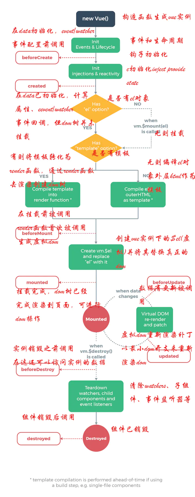

# 🍉Vue2.x🍉

关于vue2.x 的一些小知识，不会记得很全。

```property```  :属性、性质、财产、(可以理解为在js里定义的值)       
```Attribute```  :属性、特质、(可以理解为在html标签的属性)    

# 【基础】👇
略......
>直接看官方文档👉[https://cn.vuejs.org/v2/guide/instance.html](https://cn.vuejs.org/v2/guide/instance.html)

---

## 父子传值：父 -> 子 （常用）
在子👇
```js
props:['todo']  // "prop"，类似于一个自定义 attribute。
```
在父👇
```js
 <todo-item
    v-bind:todo="item"
></todo-item>
```

---

## Vue暴露的实例与方法 （关于api）
除了数据 property，Vue 实例还暴露了一些有用的实例 property 与方法。它们都有前缀 $，以便与用户定义的 property 区分开来。例如：
```js
var data = { a: 1 }
var vm = new Vue({
  el: '#example',
  data: data
})

vm.$data === data // => true
vm.$el === document.getElementById('example') // => true

// $watch 是一个实例方法
vm.$watch('a', function (newValue, oldValue) {
  // 这个回调将在 `vm.a` 改变后调用
})
```
API参考：[https://cn.vuejs.org/v2/api/#%E5%AE%9E%E4%BE%8B-property](https://cn.vuejs.org/v2/api/#%E5%AE%9E%E4%BE%8B-property)

>一个vue项目制new Vue一次，通常是在main.js里，这次实例化的Vue对象是根组件，其他的子组件都是通过配置文件的方式一层一层的叠加上的，通过vue组件配置进行叠加的子组件，其实是vue的一种省略机制，它避免了你每次都去实例化子组件。   
vue-cli生成的项目脚手架里，通过webpack配置很好的处理了这些问题，每个单文件组件 *。vue js输出的就是一份配置，就足够了，最终他们都会汇总到app.vue，app.vue再在main.js里实例化，也就是说这套脚手架里面只有一个实例化对象。

**new Vue在vue2.x的vue-cli中出现在main.js 但是vue3.0中木有**
**在vue-cli中要用this.$data 这样来得到vue的api**


## 生命周期钩子（常用）
👇就是这些 特定时候触发的钩子 整个网页生成、更新、销毁...的时候  
```created``` ```mounted```  ```updated``` 等等......

生命周期钩子的 this 上下文指向调用它的 Vue 实例。

::: danger  
不要在选项 property 或回调上使用箭头函数，比如 created: () => console.log(this.a) 或 vm.$watch('a', newValue => this.myMethod())。因为箭头函数并没有 this，this 会作为变量一直向上级词法作用域查找，直至找到为止，经常导致 Uncaught TypeError: Cannot read property of undefined 或 Uncaught TypeError: this.myMethod is not a function 之类的错误。  
:::




---


## 动态参数 (2.6.0 新增的)
::: tip
2.6.0 新增
:::
```html
<a v-bind:[attributeName]="url"> ... </a>
```
如果你的 Vue 实例有一个 data property attributeName，其值为 "href"，那么这个绑定将等价于 v-bind:href

## 修饰符
```html
<form v-on:submit.prevent="onSubmit">...</form>
```
修饰符 (modifier) 是以半角句号 . 指明的特殊后缀，用于指出一个指令应该以特殊方式绑定。例如，.prevent 修饰符告诉 v-on 指令对于触发的事件调用 event.preventDefault()


---


## 计算属性（常用）
```js
computed: {
    // 计算属性的 getter
    xxg: function () {
      // `this` 指向 vm 实例
      return this.message
    }
  }
```
这里我们声明了一个计算属性 reversedMessage。我们提供的函数将用作 property vm.reversedMessage 的 getter 函数：
```js
console.log(vm.reversedMessage) // => 'olleH'
vm.message = 'Goodbye'
console.log(vm.reversedMessage) // => 'eybdooG'
```

### 1、计算属性缓存 vs 方法
**计算属性是基于它们的响应式依赖进行缓存的**
如果你不希望有缓存，请用方法来替代


### 2、计算属性 vs 侦听属性
Vue 提供了一种更通用的方式来观察和响应 Vue 实例上的数据变动：侦听属性。当你有一些数据需要随着其它数据变动而变动时，你很容易滥用 watch——特别是如果你之前使用过 AngularJS。然而，通常更好的做法是使用计算属性而不是命令式的 watch 回调。  

>👇 下面这个例子不错，抄过来！，是vue官方文档的
```html
<div id="demo">{{ fullName }}</div>
```
```js
var vm = new Vue({
  el: '#demo',
  data: {
    firstName: 'Foo',
    lastName: 'Bar',
    fullName: 'Foo Bar'
  },
  watch: {
    firstName: function (val) {
      this.fullName = val + ' ' + this.lastName
    },
    lastName: function (val) {
      this.fullName = this.firstName + ' ' + val
    }
  }
})
```
上面代码是命令式且重复的。将它与计算属性的版本进行比较👇
```js
var vm = new Vue({
  el: '#demo',
  data: {
    firstName: 'Foo',
    lastName: 'Bar'
  },
  computed: {
    fullName: function () {
      return this.firstName + ' ' + this.lastName
    }
  }
})
```
好得多了，不是吗？ o(￣▽￣)ｄ

### 3、计算属性的 setter （少用）
计算属性默认只有 getter，不过在需要时你也可以提供一个 setter：
```js
computed: {
  fullName: {
    // getter
    get: function () {
      return this.firstName + ' ' + this.lastName
    },
    // setter
    set: function (newValue) {
      var names = newValue.split(' ')
      this.firstName = names[0]
      this.lastName = names[names.length - 1]
    }
  }
}
```
>但是这个很少用到


## 侦听器（watch 常用）

```js
watch: {
    // 如果 `question` 发生改变，这个函数就会运行
    question: function (newQuestion, oldQuestion) {
      this.answer = 'Waiting for you to stop typing...'
      this.debouncedGetAnswer()
    }
  },
```
除了 watch 选项之外，您还可以使用命令式的 vm.$watch API。

>原文中的知识  👇
[https://cn.vuejs.org/v2/guide/computed.html#%E8%AE%A1%E7%AE%97%E5%B1%9E%E6%80%A7%E7%9A%84-setter](https://cn.vuejs.org/v2/guide/computed.html#%E8%AE%A1%E7%AE%97%E5%B1%9E%E6%80%A7%E7%9A%84-setter)  
// `_.debounce` 是一个通过 Lodash 限制操作频率的函数。
// 在这个例子中，我们希望限制访问 yesno.wtf/api 的频率
// AJAX 请求直到用户输入完毕才会发出。想要了解更多关于
// `_.debounce` 函数 (及其近亲 `_.throttle`) 的知识，
// 请参考：https://lodash.com/docs#debounce


---


## Class与Style的动态绑定（常用）

### 对象语法
>直接上例子吧
```html
<div v-bind:class="{ active: isActive }"></div>
```
```js
data: {
  isActive: true,
}
```
👆上面是基本的，下面是联合 “计算” - computed
```html
<div v-bind:class="classObject"></div>
```
```js
computed: {
  classObject: function () {
    return {
      active: this.isActive && !this.error,
      'text-danger': this.error && this.error.type === 'fatal'
    }
  }
}
```

>[1] truthy 不是 true，详见 MDN 的解释。truthy是真值，意思就是有值。

### 自动添加前缀 （！！！）
当 v-bind:style 使用需要添加浏览器引擎前缀的 CSS property 时，如 transform，Vue.js 会自动侦测并添加相应的前缀。


### 多重值（少用）
```html
<div :style="{ display: ['-webkit-box', '-ms-flexbox', 'flex'] }"></div>
```
这样写只会渲染数组中最后一个被浏览器支持的值。在本例中，如果浏览器支持不带浏览器前缀的 flexbox，那么就只会渲染 display: flex

---

## 条件渲染
```v-if``` ```v-else-if``` ```v-else``` 这些

### 在 ```<template>``` 元素上使用 ```v-if``` 条件渲染分组

```<template>``` 元素当做不可见的包裹元素，并在上面使用 ```v-if```。最终的渲染结果将不包含 ```<template>```元素。
```html
<template v-if="ok">
  <h1>Title</h1>
  <p>Paragraph 1</p>
  <p>Paragraph 2</p>
</template>
```

### 用 key 管理可复用的元素
>这里不算特别重要的内容，但还是复制过来 - 网址 哈哈
[https://cn.vuejs.org/v2/guide/conditional.html#%E7%94%A8-key-%E7%AE%A1%E7%90%86%E5%8F%AF%E5%A4%8D%E7%94%A8%E7%9A%84%E5%85%83%E7%B4%A0](https://cn.vuejs.org/v2/guide/conditional.html#%E7%94%A8-key-%E7%AE%A1%E7%90%86%E5%8F%AF%E5%A4%8D%E7%94%A8%E7%9A%84%E5%85%83%E7%B4%A0)


### ```v-show```
v-if  是 -> 是否有这个标签  
v-show 是 -> 是否显示 （虽然中国东西很早就清楚了）  
v-show 不支持 ```<template>``` 元素  


### ```v-if``` 与 ```v-for``` 一起使用

::: 
不推荐同时使用 v-if 和 v-for
:::


---


## 列表渲染
👉 ```v-for```  
👉 ```item in items```   
你也可以用 of 替代 in 作为分隔符，因为它更接近 JavaScript 迭代器的语法：

### 在 ```v-for``` 里使用对象
会遍历出：值  

当然 可以带上key键 比如：
```html
<div v-for="(value, name, index) in object">
  {{ index }}. {{ name }}: {{ value }}
</div>
```
还可以带上👆index 索引 o(￣▽￣)ｄ


### 数组更新检测

#### 变更方法
Vue 将被侦听的数组的变更方法进行了包裹，所以它们也将会触发视图更新。这些被包裹过的方法包括：
- ```push()```
- ```pop()```
- ```shift()```
- ```unshift()```
- ```splice()```
- ```sort()```
- ```reverse()```

#### 替换数组
变更方法，顾名思义，会变更调用了这些方法的原始数组。相比之下，也有非变更方法，例如 ```filter()```、```concat()``` 和 ```slice()```。它们不会变更原始数组，而总是返回一个新数组。当使用非变更方法时，可以用新数组替换旧数组：


## 显示过滤/排序后的结果
>举个例子 我想把 ```[3,8,4,1]``` 按顺序来排列
但是不想变更原来的这组数据，那就用“计算属性”！👇
```js
computed: {
  evenNumbers: function () {
    return this.numbers.filter(function (number) {
      return number % 2 === 0
    })
  }
}
```
在“计算属性”不适用的情况下 在methos里用一个方法

---

## 事件处理
```v-on```简写 - ```@```  

其他的就不记了

### 👇`$event`  `event` 是原生 DOM 事件
有时也需要在内联语句处理器中访问原始的 DOM 事件。可以用特殊变量 ```$event``` 把它传入方法：
```html
<button v-on:click="warn('Form cannot be submitted yet.', $event)">
  Submit
</button>
```
```js
// ...
methods: {
  warn: function (message, event) {
    // 现在我们可以访问原生事件对象
    if (event) {
      event.preventDefault()
    }
    alert(message)
  }
}
```

### 事件修饰符 (少用)
在事件处理程序中调用 `event.preventDefault()` 或 `event.stopPropagation()` 是非常常见的需求。尽管我们可以在方法中轻松实现这点，但更好的方式是：方法只有纯粹的数据逻辑，而不是去处理 DOM 事件细节。

为了解决这个问题，Vue.js 为 `v-on` 提供了事件修饰符。之前提过，修饰符是由点开头的指令后缀来表示的。


- `.stop`
- `.prevent`
- `.capture`
- `.self`
- `.once`
- `.passive`

```html
<!-- 阻止单击事件继续传播 -->
<a v-on:click.stop="doThis"></a>

<!-- 提交事件不再重载页面 -->
<form v-on:submit.prevent="onSubmit"></form>

<!-- 修饰符可以串联 -->
<a v-on:click.stop.prevent="doThat"></a>

<!-- 只有修饰符 -->
<form v-on:submit.prevent></form>

<!-- 添加事件监听器时使用事件捕获模式 -->
<!-- 即内部元素触发的事件先在此处理，然后才交由内部元素进行处理 -->
<div v-on:click.capture="doThis">...</div>

<!-- 只当在 event.target 是当前元素自身时触发处理函数 -->
<!-- 即事件不是从内部元素触发的 -->
<div v-on:click.self="doThat">...</div>
```

####  once - 点击事件将只会触发一次 
```html
<a v-on:click.once="doThis"></a>
```
#### passive
Vue 还对应 addEventListener 中的 passive 选项提供了 .passive 修饰符。
```html
<!-- 滚动事件的默认行为 (即滚动行为) 将会立即触发 -->
<!-- 而不会等待 `onScroll` 完成  -->
<!-- 这其中包含 `event.preventDefault()` 的情况 -->
<div v-on:scroll.passive="onScroll">...</div>
```
这个 .passive 修饰符尤其能够提升移动端的性能。


:::
不要把 .passive 和 .prevent 一起使用，因为 .prevent 将会被忽略，同时浏览器可能会向你展示一个警告。请记住，.passive 会告诉浏览器你不想阻止事件的默认行为。
:::


---


### 按键修饰符
在监听键盘事件时，我们经常需要检查详细的按键。Vue 允许为 ```v-on``` 在监听键盘事件时添加按键修饰符：
```html
<!-- 只有在 `key` 是 `Enter` 时调用 `vm.submit()` -->
<input v-on:keyup.enter="submit">
```
你可以直接将 ```KeyboardEvent.key``` 暴露的任意有效按键名转换为 ```kebab-case``` 来作为修饰符。
```html
<input v-on:keyup.page-down="onPageDown">
在上述示例中，处理函数只会在 $event.key 等于 PageDown 时被调用。
```

### 按键码别名：(这些修饰符都蛮少用的)
```html
<input v-on:keyup.enter="submit">
```
- .enter
- .tab
- .delete (捕获“删除”和“退格”键)
- .esc
- .space
- .up
- .down
- .left
- .right

### 系统修饰键 (这些修饰符都蛮少用的)
可以用如下修饰符来实现仅在按下相应按键时才触发鼠标或键盘事件的监听器。

- .ctrl
- .alt
- .shift
- .meta

:::
请注意修饰键与常规按键不同，在和 ```keyup``` 事件一起用时，事件触发时修饰键必须处于按下状态。换句话说，只有在按住 ```ctrl``` 的情况下释放其它按键，才能触发 ```keyup.ctrl```。而单单释放 ```ctrl``` 也不会触发事件。如果你想要这样的行为，请为 ```ctrl``` 换用 ```keyCode```：```keyup.17```。
:::

### .exact 修饰符 (这些修饰符都蛮少用的)
.exact 修饰符允许你控制由精确的系统修饰符组合触发的事件。
```html
<!-- 即使 Alt 或 Shift 被一同按下时也会触发 -->
<button v-on:click.ctrl="onClick">A</button>

<!-- 有且只有 Ctrl 被按下的时候才触发 -->
<button v-on:click.ctrl.exact="onCtrlClick">A</button>

<!-- 没有任何系统修饰符被按下的时候才触发 -->
<button v-on:click.exact="onClick">A</button>
```

### 鼠标按钮修饰符 (这些修饰符都蛮少用的)
> 有了事件修饰符，键盘修饰符，那就肯定有鼠标修饰符啦！！！

- .left
- .right
- .middle

### 为什么在 HTML 中监听事件？
>虽然这个不是重点，但是我觉得他说的很对，所以copy过来，因为js里就真的只要处理逻辑就好了，而不用的管理这个按键是怎么触发发生的。  
触发的条件交给html的属性，js完完全全写业务逻辑代码 o(￣▽￣)ｄ

👇原话：👇    
你可能注意到这种事件监听的方式违背了关注点分离 (separation of concern) 这个长期以来的优良传统。但不必担心，因为所有的 Vue.js 事件处理方法和表达式都严格绑定在当前视图的 ViewModel 上，它不会导致任何维护上的困难。实际上，使用 v-on 有几个好处：

1. 扫一眼 HTML 模板便能轻松定位在 JavaScript 代码里对应的方法。

2. 因为你无须在 JavaScript 里手动绑定事件，你的 ViewModel 代码可以是非常纯粹的逻辑，和 DOM 完全解耦，更易于测试。

3. 当一个 ViewModel 被销毁时，所有的事件处理器都会自动被删除。你无须担心如何清理它们。


----
-----

## 表单输入绑定
```v-model``` 
基础 - 略

### 复选框
多个复选框，绑定到同一个数组：
```html
<input type="checkbox" id="jack" value="Jack" v-model="checkedNames">
<label for="jack">Jack</label>
<input type="checkbox" id="john" value="John" v-model="checkedNames">
<label for="john">John</label>
<input type="checkbox" id="mike" value="Mike" v-model="checkedNames">
<label for="mike">Mike</label>
<br>
<span>Checked names: {{ checkedNames }}</span>
```
```js
new Vue({
  el: '...',
  data: {
    checkedNames: []
  }
})
```
选中的就会在 checkedNames中多一个value值出来。

### 单选
```html
<div id="example-4">
  <input type="radio" id="one" value="One" v-model="picked">
  <label for="one">One</label>
  <br>
  <input type="radio" id="two" value="Two" v-model="picked">
  <label for="two">Two</label>
  <br>
  <span>Picked: {{ picked }}</span>
</div>
```
```js
new Vue({
  el: '#example-4',
  data: {
    picked: ''
  }
})
```

### 选择框
#### 单选选择框
```html
<div id="example-5">
  <select v-model="selected">
    <option disabled value="">请选择</option>
    <option>A</option>
    <option>B</option>
    <option>C</option>
  </select>
  <span>Selected: {{ selected }}</span>
</div>
```
```js
new Vue({
  el: '...',
  data: {
    selected: ''
  }
})
```

:::
如果 `v-model` 表达式的初始值未能匹配任何选项，`<select>` 元素将被渲染为“未选中”状态。在 iOS 中，这会使用户无法选择第一个选项。因为这样的情况下，iOS 不会触发 change 事件。因此，更推荐像上面这样提供一个值为空的禁用选项。
:::

### 值绑定
#### 复选框
```html
<input
  type="checkbox"
  v-model="toggle"
  true-value="yes"   //选择中
  false-value="no"   //没有选中
>
```
#### 单选
```html
<input type="radio" v-model="pick" v-bind:value="a">
```

### 修饰符 (！！！)

#### `.lazy`
在默认情况下，v-model 在每次 input 事件触发后将输入框的值与数据进行同步 (除了上述输入法组合文字时)。你可以添加 lazy 修饰符，从而转为在 change 事件_之后_进行同步：

```html
<!-- 在“change”时而非“input”时更新 -->
<input v-model.lazy="msg">
```
>意思是 在改变的时候更新，而不是在输入的时候更新
改变有很多方式，但是输入就只有键盘输入等...

#### `.number`
如果想自动将用户的输入值转为数值类型，可以给 v-model 添加 number 修饰符：
```html
<input v-model.number="age" type="number">
```
这通常很有用，因为即使在 type="number" 时，HTML 输入元素的值也总会返回字符串。如果这个值无法被 parseFloat() 解析，则会返回原始的值

#### `.trim`
如果要自动过滤用户输入的首尾空白字符，可以给 v-model 添加 trim 修饰符：
```html
<input v-model.trim="msg">
```


--- 

## 组件基础

略略略...

### data 必须是一个函数

```js
data: function () {
  return {
    count: 0
  }
}
```
>[https://cn.vuejs.org/v2/guide/components.html#data-%E5%BF%85%E9%A1%BB%E6%98%AF%E4%B8%80%E4%B8%AA%E5%87%BD%E6%95%B0](https://cn.vuejs.org/v2/guide/components.html#data-%E5%BF%85%E9%A1%BB%E6%98%AF%E4%B8%80%E4%B8%AA%E5%87%BD%E6%95%B0)


## 监听子组件事件
>在子组件的触发 -> 在父组件感知到，然后运用方法 哈哈 o(￣▽￣)ｄ

在父组件中：👇设置一个按钮 只不过这个按钮的触发器在 子组件里
```html
<blog-post v-on:enlarge-text="postFontSize += 0.1"></blog-post>
```

**```$emit```** 👈 就是这个！！  
**在子组件中按这个按钮就可以在触发父组件的事件！！**
```html
<button v-on:click="$emit('enlarge-text')">
  Enlarge text
</button>
```


👇
还可以带值
```html
<button v-on:click="$emit('enlarge-text', 0.1)">
  Enlarge text
</button>
```
然后当在父级组件监听这个事件的时候，我们可以通过 $event 访问到被抛出的这个值：
```html
<blog-post
  ...
  v-on:enlarge-text="postFontSize += $event"
></blog-post>
```
>简单的说，父组件的$event 是可以接受子组件$event


或者，如果这个事件处理函数是一个方法：
```html
<blog-post
  ...
  v-on:enlarge-text="onEnlargeText"
></blog-post>
```
那么这个值将会作为第一个参数传入这个方法：  
>就是可以省略不写，他会自动传到方法里的第一个参数
```js
methods: {
  onEnlargeText: function (enlargeAmount) {
    this.postFontSize += enlargeAmount
  }
}
```

## 在组件上使用 v-model

>详细请参考官方文档：[https://cn.vuejs.org/v2/guide/components.html#%E5%9C%A8%E7%BB%84%E4%BB%B6%E4%B8%8A%E4%BD%BF%E7%94%A8-v-model](https://cn.vuejs.org/v2/guide/components.html#%E5%9C%A8%E7%BB%84%E4%BB%B6%E4%B8%8A%E4%BD%BF%E7%94%A8-v-model)

```html
<custom-input v-model="searchText"></custom-input>
```


---


## 通过插槽分发内容

```<slot></slot>```


## 动态组件
```html
<component v-bind:is="currentTabComponent"></component>
```

```currentTabComponent``` 
- 已注册组件的名字，或
- 一个组件的选项对象

>我觉得这个非常重要，因为我们在写动态组件的时候，要不就是写出了很多个组件，然后再用v-if 来判断它按下了哪个相关的组件，让它的v-if是true， 而这里直接就一个组件，然后用is的方式来让人家选择 选好后就只要替换掉currentTabComponent这个变量就行了。
👇 比如：
```html
<xxg_1 v-if='lala = one'></xxg_1>
<xxg_2 v-if='lala = two'></xxg_2>
<xxg_3 v-if='lala = three'></xxg_3>
```
所以其实还是
```html
<component v-bind:is="lala_xxg"></component>
//然后让lala_xxg = xxg_1 或是xxg_2 或是xxg_3
```


## 解析 DOM 模板时的注意事项
有些 HTML 元素，诸如``` <ul>、<ol>、<table> 和 <select>，```对于哪些元素可以出现在其内部是有严格限制的。而有些元素，诸如 ```<li>、<tr> 和 <option>，```只能出现在其它某些特定的元素内部。

这会导致我们使用这些有约束条件的元素时遇到一些问题。例如：
```html
<table>
  <blog-post-row></blog-post-row>
</table>
```
这个自定义组件 ```<blog-post-row> ```会被作为无效的内容提升到外部，并导致最终渲染结果出错。幸好这个特殊的 ```is``` attribute 给了我们一个变通的办法：

需要注意的是如果我们从以下来源使用模板的话，这条限制是不存在的：

- 字符串 ```(例如：template: '...')```
- 单文件组件 ```(.vue)```
- ```<script type="text/x-template">```

>比如我们在vue-cli创建的项目里 的.vue里面就不会出现这种情况 不用使用is...

哦 那没事了！

## 【完】- 〖基础的完〗

好，那这就是关于Vue官方文档的一点点小总结 是基础的小总结，
是基础的总结  基础的【完】


