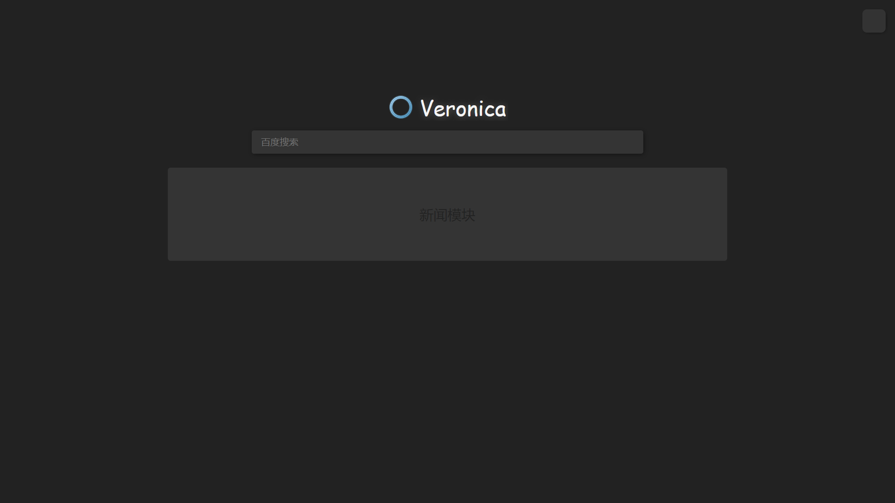
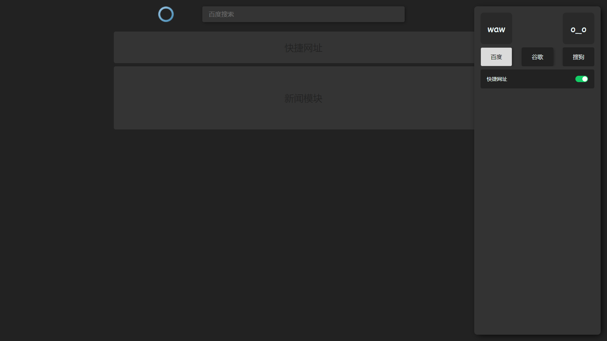
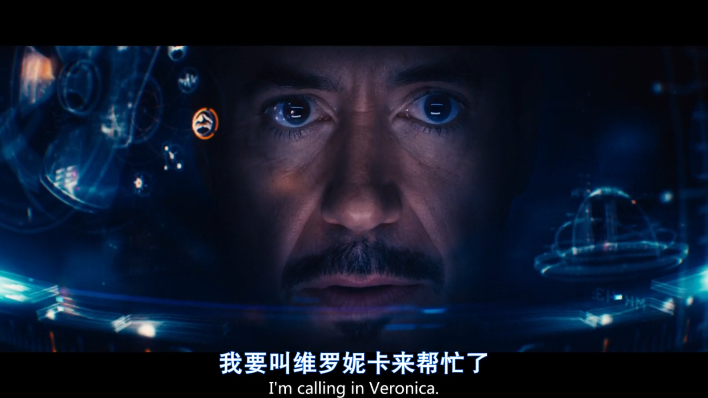
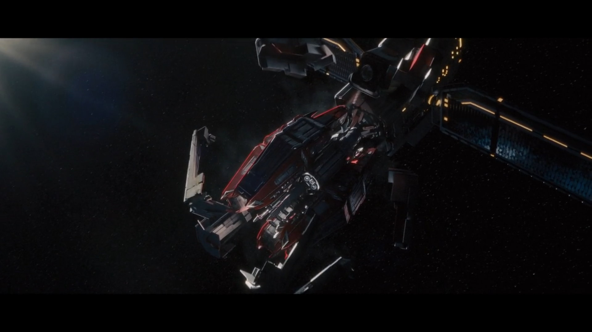
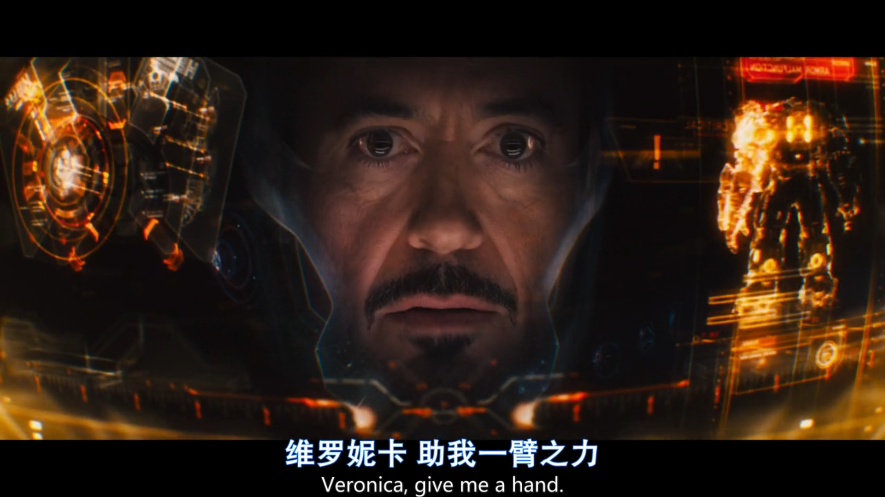

# Veronica

## 简约 暗黑浏览器主页

项目地址：  
[https://xxggg.github.io/Veronica](https://xxggg.github.io/Veronica)  
[https://xxggg.gitee.io/Veronica](https://xxggg.gitee.io/Veronica)  （码云 - 打不开github page用这个！）

由于手机端不需要浏览器的主页，大部分手机浏览器都自带主页/首页 而且也无法更改  
而且手机浏览器首页主页的意义也不大，大部分人主要功能更喜欢浏览器自带的主要功能，或者APP。  

所以Veronica只做 电脑端 （少量适配）  

**【即使在pc上用 如果不是国内浏览器，像edge，chrome都是没办法设定为新标签页的，即使可以设置为主页，但是当新建标签页时，就会回到浏览器本身的标签页，除非是开发成浏览器插件。所以这个首页 感觉意义不大，但是可以开发来玩玩】（2020-11-16）**  

> 目前还在摸索开发中  

**主要用于自用或者给朋友用** 

---
## 名字灵感来源

  
   
   
  

---